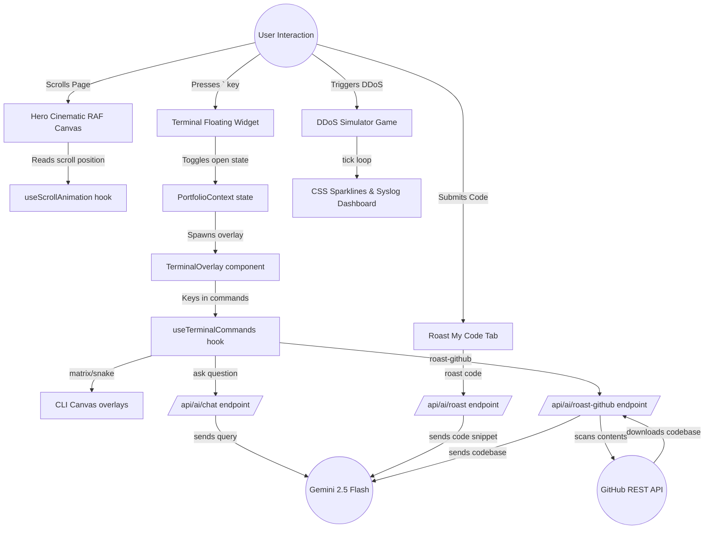

# Systems Architecture Map

This directory details the logical flow, system connections, and implementations of the interactive components in this portfolio.

---

## 📂 Core Folder Structure

```
anirudha-basu-thakur-portfolio/
├── app/                      # Next.js App Router (Routing & APIs Only)
│   ├── api/
│   │   ├── ai/
│   │   │   ├── chat/         # AI Twin Assistant Endpoint
│   │   │   ├── roast/        # Standalone Code Roasting Endpoint
│   │   │   └── roast-github/ # Repo Analyzer & Roasting Endpoint
│   │   ├── contact/          # Email Form Endpoint
│   │   └── github/           # Live Event Stream Feeds
│   ├── globals.css           # Custom CSS animations & Tailwind setup
│   ├── layout.tsx            # Global HTML layout template
│   └── page.tsx              # Next.js Entry Segment
│
├── components/               # UI Layer (Divided by scope)
│   ├── effects/              # Canvas scroll background animations
│   ├── features/             # Telemetry graphs, CLI modules, code editors
│   ├── sections/             # Page structural sections (Hero, Skills, Sandbox)
│   └── ui/                   # Global components (Navbar, Footers, Cursors)
│
├── hooks/                    # Logic Layer (Dynamic loops & listeners)
│   ├── useScrollAnimation.ts # Decoupled RAF Scroll Engine
│   └── useTerminalCommands.ts# CLI Command parser & shell history
│
└── context/                  # Global State (Hotkeys, visibility triggers)
    └── PortfolioContext.tsx  # Keyboard context & terminal state management
```

---

## 🗺️ Architectural Logic Flow

The diagram below illustrates how user actions flow through UI page sections, context events, custom hooks, and hit backend Next.js API endpoints connecting to Gemini AI and GitHub.



---

## 📖 Deep-dive System Documentation

Explore the following articles to understand how each specialized sub-system operates:

* 🧠 [AI Integrations & Personality Engines](file:///c:/GitHub/anirudha-basu-thakur-portfolio/architecture/AI_INTEGRATION.md) - Details `/api/ai/chat`, `/api/ai/roast`, and `/api/ai/roast-github`.
* 🛡️ [DDoS Sandbox & Telemetry Systems](file:///c:/GitHub/anirudha-basu-thakur-portfolio/architecture/DDOS_SIMULATOR.md) - Details the rendering loop, syslog aggregator, and latency formulas.
* ⌨️ [CLI Hacker Shell & Graphics](file:///c:/GitHub/anirudha-basu-thakur-portfolio/architecture/CLI_SHELL.md) - Details terminal commands, canvas Matrix drops, and Snake game logic.
